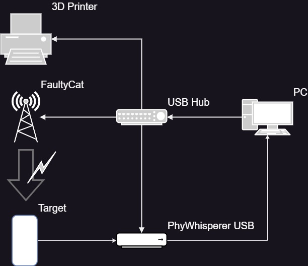

# Getting started with EMFI and FaultyCat

#hacking #emfi #faultycat #hardware #raspi 

DISCLAIMER: This text is for educational purposes only. Any use for unethical or malicious purposes is not intended or supported by the author.

## Intro to Electromagnetic Fault Injection
Electromagnetic fault injection (EMFI) is a side-channel attack that induces faults in an integrated circuit by means of an electromagnetic field, usually a short pulse. This pulse injects a voltage in the structure of the IC die and leads to a system reaction. 

There are different tools on the market of which ChipShouter by NewAE Technology Inc. is by far the most common but also most cost-intensive. Lower cost tools, like PicoEMP or FaultyCat, usually provide less options to configure and trigger the pulse.

The pulse is transmitted by a probe, usually referred to as "hot end" or "business end", which is actually a coil with a low number of winding around a ferrite rod which concentrates and "guides" the magnetic flux in order to point it towards a target at a short range of 0 to 2mm and limit the effect on the target device.

Three main parameter must be controlled in order to achieve a successful glitch: The EM pulse itself, the location of the probe, and the trigger, i.e. the timing. Based on these the target may react, but usually with a limited ratio of success, even with the exactly same main parameters, other factor like temperature may have an effect. Depending on how specific a intended system reaction is expected, success ratios of 1-2% can already be considered high, while in other, less specific cases 25% and more can be achieved.

Reactions to induction a electromagnetic pulse can be categorized as follows:
1. No reaction
2. Reset
3. Useful reaction, glitch
	- Jumps or skipping of instructions
	- incorrect data fetch
	- incorrect instruction fetch
	- write faults

Since most simple to achieve the following tests will aim for a jump in a setup where timing is of less importance.

## Set up FaultyCat
Setting up FaultyCat is pretty simple if the documentation on https://github.com/ElectronicCats/faultycat/wiki is followed. Having said that, the actual usage of the device is less in focus of the official documentation which has eventually led to creation of this post.

The device supports a manual mode using the two push-buttons on the PCB which allow to first arm the device, i.e. charge the capacitor, and when charged activate the pulse. While this mode of operation does not seem to have any way to deliver reproducible results or allow configuration, the disarming functionality of the Arming button is sometimes helpful when the operation via UART fails.
Mentioning UART, this appears to be the most convenient mode to operate FaultyCat. Connecting with a baud rate of 115200 leads to a menu that appears to be "inspired" by PicoEMP. The menu, even if has some bugs like displaying the correct pulse power in the configuration menu, allows usage of all relevant functions of the FaultyCat and enables experimenting with it.

The usual workflow for experimenting is
1. Configure pulse with [c]
2. Arm device with [a]
3. Apply pulses with [p]
4. Disarm device with [d]
The timeout, which can be enabled and disabled, automatically discharges the device after 60 seconds. The current status of all relevant settings can be checked using [s]. All settings including the connection itself are lost when [r] is used to reset, which doesn't make it very useful in manual operation.
FaultyCat also comes with a Python interface which has not turned out to be very useful, in particular when starting to move towards an automated setup.

### Configuration of FaultyCat
FaultyCat uses two parameters to control the EM pulse itself:
Pulse Time or Pulse Duration defines how long the MOSFET which discharges the high-voltage capacitor through the coil of the "hot end" by means of the signal HVPULSE. Pulse Power defines the duty cycle of the PWM (named HVPWM) which drives the isolated switch-mode power supply that charges the high-voltage capacitor. Both signals can be observed on the pins of J4 (HVPULSE) and J5 (HVPWM).

#### Pulse Duration
The first finding working with the FaultyCat configuration is that the pulse duration has no actual effect on the result, which will be confirmed by the measurements below. Analyzing the firmware it turns out that pulse duration is implemented by `sleep_us`.
```C
gpio_put(PIN_OUT_HVPULSE, true);
sleep_us(pulse_time);
gpio_put(PIN_OUT_HVPULSE, false);
```
Actual measurements on HVPULSE show very inaccurate output results. This may be a result of parallel execution of serial communication and pulse generation. Basically Pulse Duration is only the minimum duration of the on-phase of the discharge MOSFET, but longer durations are the standard. As a consequence, pulse time seems to have no effect on the actual EM pulse shape and are kept at 5 microseconds for the rest of this post.

#### Pulse Power
Observing the results of EM pulses, it turned out that some configuration changes seemed to have no effect. The reason for that can again be found in the firmware: changes to the pulse power only become effective, i.e. PWM duty cycle is only changed when PWM is disabled which is the case when the device is disarmed, even when the user interface confirms the updated settings. 
```C
void picoemp_enable_pwm(float duty_frac) {
    if(pwm_enabled) {
        return;
    }
//...
}
```
Consequently disarming is mandatory before changing the configuration.

#### Measuring EM pulses
With a very simple setup using a cheap EMC sniffer probe and an oscilloscope the effects of the above described configuration parameters can be observed. 

The results confirm what has been assumed based on firmware analysis and measurements of HVPULSE and HVPWM before:
1. Pulse Duration has no effect: The discharge is completed after a maximum of 250ns, consequently setting a pulse duration in the microsecond range does not change the pulse itself
2. Useful values for Pulse Power appear to be in the range of 0.001 to 0.010:

Values larger than 0.012 do not show any effect; likely the secondary voltage at the capacitor reaches its maximum at this setting.

### Difference Fast-Trigger vs. External HVP
Apart from manual and UART controlled trigger, FaultyCat also supports two other trigger mode. Fast-Trigger enables the external activation of the configured pulse via GPIO0. Which may allow a more accurate timing. External HVP directly controls the HV_PULSE signal which activated the HV switch. Power still has to be defined by configuration of the device and is not persistent in memory.

## Create a Raspberry Pico Target
FaultyCat Wiki suggests to build a test setup with a Raspberry Pico and provides source code for the Arduino IDE. For reasons of consistent parameter a fixture to mount FaultyCat and Raspberry Pico is mandatory.

The following code is an alternative to the target code proposed by FaultCat. While the original code used a `sleep` function to pause between `println` commands in the main loop, the code below uses a for-loop to create the delay and adds the delay counter (`dly`) to the main counter. In addition GPIO Pin 22 is used to monitor in which part of the main loop the execution currently operates which can be used for an external trigger later on.  
Why a for loop and why adding the delay counter to the main counter? As monitoring GPIO22 reveals, the controller remains in the for-loop for the majority of the time. This makes timing of the EM pulse easier, because the pulse shall effect the program flow and not the serial communication. If a glitch was successful, i.e. an EM pulse caused a jump or caused skipping jump back to top of the for-loop,  `j` is not 0 at the time of printing to UART, as it should be in case the for-loop finishes as intended. A successful glitch becomes visible as soon as the Rasperry Pico sends a unexpected high numeric value instead of its usual main counter. This can easily be monitored externally.
```C
int i, j;
int dly;

void setup() {
  Serial.begin(115200);
  pinMode(22, OUTPUT);
  j=0;
  i=0;
}

void loop() {
  Serial.println(i+j);
  i++;
  digitalWrite(22, HIGH);

  for(dly = 10000000; dly > 0; dly--){
    j = dly;
  }  
  digitalWrite(22, LOW);
}
```
It turns out that successful glitches are much more likely to achieve in the upper left corner of the RP2040 microcontroller used on the Raspberry Pico with this specific program. This requires further investigations with an automated setup.

## Convert to Automated Setup
As pointed out earlier, repeatable positioning is one of the main parameters to achieve a successful glitch. To achieve this a 3D printer or CNC positioning system is the most common solution, replacing printing nozzle or motor with the EMFI probe, in this case FaultyCat. 3D positioning systems can be conveniently controlled sending GCode commands via UART interface provided over USB connection.

In addition to positioning and EMFI probe the target must be observed during the procedure to determine which of the possible reactions the target shows during and after the pulse application. While reactions which lead to a continued operation of the target allow immediate continuation of the test procedure, the target may result in a state after pulse application, that requires a reset. While for many devices a simple relais will do the job, in case of the Raspberry Pico a PhyWhisperer USB was chosen to reset power supply over USB. 



All four devices can be controlled with a Python script that has been published here:
https://github.com/vector247/EMFIScanner

## Results
As discussed earlier there are three main reactions to be expected:
1. No reaction (shown below as green)
2. Reset (shown below are yellow)
3. Useful reaction, in this case: jump (shown below as red)

FaultyCat was set to Pulse Duration 5 and Pulse Power 0.005. The following plot shows the system reaction based on the location where the pulse has been injected. 

The initial position 0, 45 represents the lower left corner of the controller. The probe injects four pulses per position with a distance of 0.5mm between chip housing and probe tip and observes the target. If any of the four reactions is showing a jump, i.e. a single UART read of a very high number, the position is marked red. If one or more of the reactions result in a reset, but in no case a jump, the position is marked yellow. In any other case, i.e. no reaction, the position is marked green.
The picture below shows the result as an overlay on the 7mmx7mm RP2040 controller of a Raspberry Pico.


## Next steps
The abovementioned setup allows reproducible results on a very simple target. 
The next step aims to improve the setup in way that it can be used for meaningful tasks by improving the trigger of the pulse. While the trigger timing was not in scope of the target described above, on "real" targets very specific system reactions shall be achieved. This requires a precise timing based on input conditions like power analysis, UART or, in case of automotive systems, CAN.
The improved trigger can be achieved switching FaultyCat to external high-voltage pulse control and using a device like ChipWhisperer to generate this control signal based on more accurate trigger conditions.
